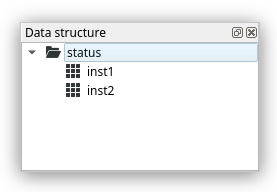
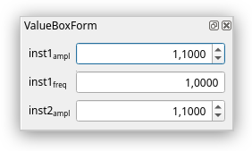

.. _api_gui_widgets:

p5control.gui.widgets
=====================

This module contains custom qt widgets, which help you quickly create your own gui. Screenshots are included to give you an idea of how the widgets look and what they do. These are taken on linux and therefore might look different on your operating system.

p5control.gui.widgets.datagw\_plot module
-----------------------------------------

.. automodule:: p5control.gui.widgets.datagw_plot
   :members:
   :undoc-members:
   :show-inheritance:

p5control.gui.widgets.datagw\_treeview module
---------------------------------------------

.. automodule:: p5control.gui.widgets.datagw_treeview
   :members:
   :undoc-members:
   :show-inheritance:

p5control.gui.widgets.editvaluebox module
-----------------------------------------

.. automodule:: p5control.gui.widgets.editvaluebox
   :members:
   :undoc-members:
   :show-inheritance:

p5control.gui.widgets.legend module
-----------------------------------

.. automodule:: p5control.gui.widgets.legend
   :members:
   :undoc-members:
   :show-inheritance:

p5control.gui.widgets.monitorvaluebox module
--------------------------------------------

.. automodule:: p5control.gui.widgets.monitorvaluebox
   :members:
   :undoc-members:
   :show-inheritance:

p5control.gui.widgets.valueboxform module
-----------------------------------------

.. automodule:: p5control.gui.widgets.valueboxform
   :members:
   :undoc-members:
   :show-inheritance:
